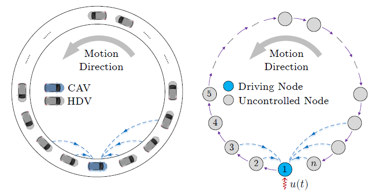
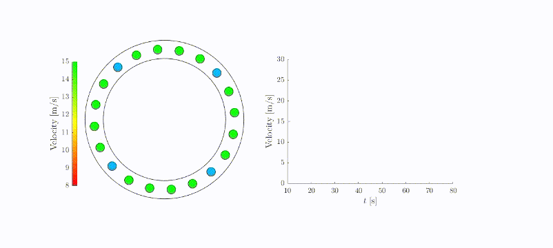

# Cooperative formation multiple

Although large-scale numerical simulations and small-scale experiments have shown promising results, 
a comprehensive theoretical understanding to smooth traffic flow via AVs is lacking. Here, from a 
control-theoretic perspective, we establish analytical results on the controllability, stabilizability, 
and reachability of a mixed traffic system consisting of HDVs and AVs in a ring road.

## Introduction

## Implementation

    mkdocs.yml    # The configuration file.
    docs/
        index.md  # The documentation homepage.
        ...       # Other markdown pages, images and other files.
* `mkdocs new [dir-name]` - Create a new project.
* `mkdocs serve` - Start the live-reloading docs server.
* `mkdocs build` - Build the documentation site.
* `mkdocs -h` - Print help message and exit.

## Animation
Two demonstrations are shown below:    

Uniform Distribution:

Platoon Formation:

## Experiment results
This folder contains files for test cases.

## Reference
Li, K., Wang, J., & Zheng, Y. (2020). Cooperative Formation of Autonomous Vehicles in Mixed Traffic Flow: Beyond Platooning. arXiv preprint arXiv:2009.04254.[pdf] Li, K., Wang, J., & Zheng, Y. (2020). 
Optimal Formation of Autonomous Vehicles in Mixed Traffic Flow. In 21st IFAC World Congress. [pdf] [slides]