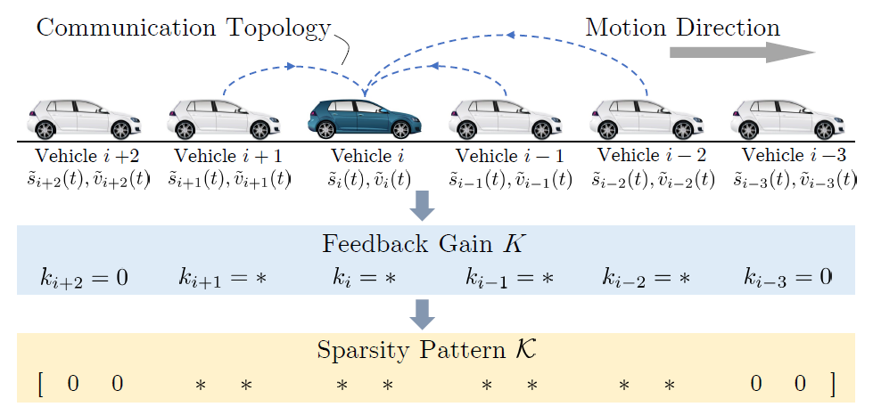
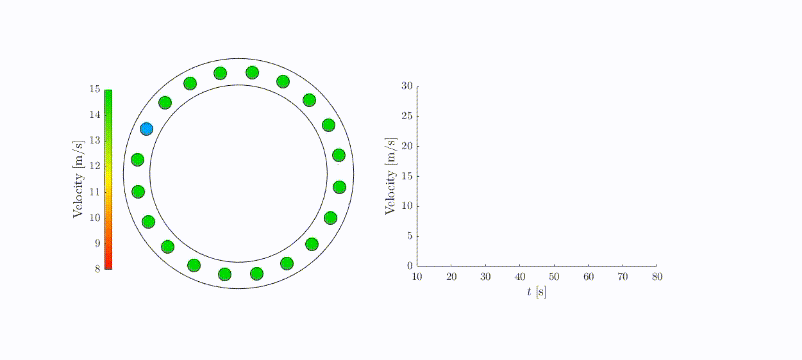

# Structured optimal control

Due to the limit of communication abilities in practice, 
the CAV can only receive partial information of the global 
traffic system for its feedback. Therefore, it is important to consider the local 
available information of the neighboring vehicles. 
This leads to the notion of structured controller design.

## Introduction

## Implementation

    mkdocs.yml    # The configuration file.
    docs/
        index.md  # The documentation homepage.
        ...       # Other markdown pages, images and other files.
* `mkdocs new [dir-name]` - Create a new project.
* `mkdocs serve` - Start the live-reloading docs server.
* `mkdocs build` - Build the documentation site.
* `mkdocs -h` - Print help message and exit.

## Animation
Two demonstrations are shown below:    

All the vehicles are HDVs: traffic wave emerges

There is one AV: dissipating traffic wave

## Experiment results
This folder contains files for test cases.

## Reference
Wang, J., Zheng, Y., Xu, Q., Wang, J., & Li, K. (2020). Controllability Analysis and Optimal Control of Mixed Traffic Flow with Human-driven and Autonomous Vehicles. IEEE Transactions on Intelligent Transportation Systems, 1-15.[pdf] Wang, J., Zheng, Y., Xu, Q., Wang, J., & Li, K. (2019, June). Controllability analysis and optimal controller synthesis of mixed traffic systems. 
In 2019 IEEE Intelligent Vehicles Symposium (IV) (pp. 1041-1047). IEEE. [pdf] [poster]